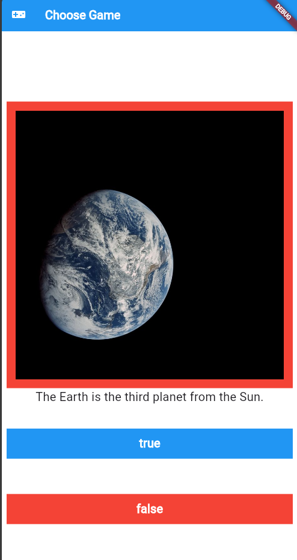

# gameChoose
"Game Choose" is a fun and fast-paced trivia game designed to test your general knowledge. In each round, a statement appears on the screen (for example: "An elephant can fly"). Your goal is to decide if the statement is correct or incorrect by pressing "Yes" or "No". Every correct choice earns you a point!
## ✨ Features
* **Simple Gameplay:** Easy-to-use "Yes" and "No" buttons.
* **Scoring System:** Tracks your progress and rewards you with a point for every correct answer.
* **Clean UI:** An eye-friendly, intuitive, and interactive user interface.
* **Diverse Statements:** A variety of fun and educational facts to keep the game exciting.

## 🚀 Built With
* [Flutter](https://flutter.dev/)
* [Dart](https://dart.dev/)

## 📸 Screenshots

